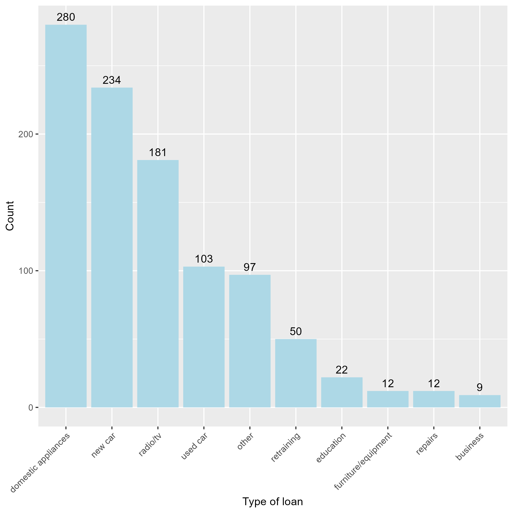
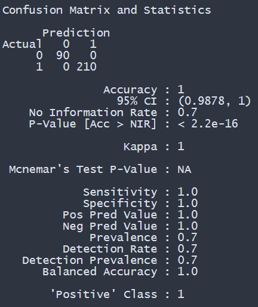

# German credit risk prediction

Data set is a credit scoring data set that can be used to predict defaults on consumer loans. There are 1,000 observation (no missing values) and 20 predictors which containing the following:

Credit_risk: a factor with levels "BAD" and "GOOD".

Account_status: a factor with four levels representing the amount of money in the account or "no checking account".

Duration: a continuous variable, the duration in months.

Credit_history: a factor with five levels representing possible credit history backgrounds.

Purpose: a factor with ten levels representing possible reasons for taking out a loan.

Credit_amount: a continuous variable.

Savings_bonds: a factor with five levels representing amount of money available in savings and bonds or "unknown / no savings account".

Present_employment_since: a factor with five levels representing the length of tenure in the current employment or "unemployed".

Installment_rate: a continuous variable, the installment rate in percentage of disposable income.

Other_debtors_guarantors: a factor with levels "none", "co-applicant" and "guarantor".

Resident_since: a continuous variable, number of years in the current residence.

Property: a factor with four levels describing the type of property to be bought or "unknown / no property".

Age: a continuous variable, the age in years.

Other_installment_plans: a factor with levels "bank", "none" and "stores".

Housing: a factor with levels "rent", "own" and "for free".

Existing_credits: a continuous variable, the number of existing credit lines at this bank.

Job: a factor with four levels for different job descriptions.

People_maintenance_for: a continuous variable, the number of people being liable to provide maintenance for.

Telephone: a factor with levels "none" and "yes".

Foreign_worker: a factor with levels "no" and "yes".

Gender: a factor with levels "Male" and "Female".

The `Credit_risk` is response variable which is used for the classification prediction. 

The most common purpose for a loan for the data set is domestic appliances shown in the plot below

The data set contains 7 numeric and 14 categorical variables which where one-hot encoded for the purpose of the modeling. The data set was randomly assign (70%/30%) to training and testing sets. Cross validation (5-fold) was performed to determine the optimal model. Extreme Gradient Boosting (`XGBOOST`) performed better than the other model. The results are shown below. The model accurately predicted all test observations.

